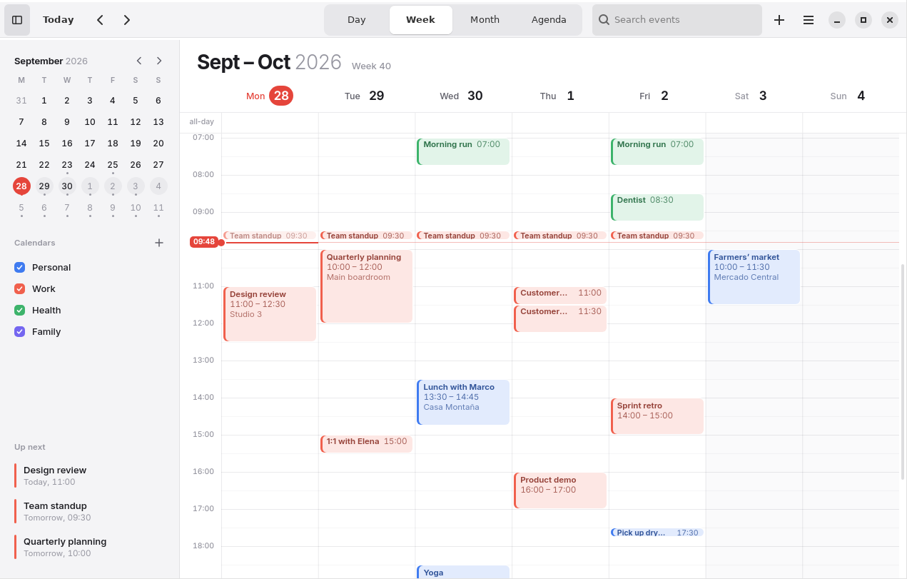
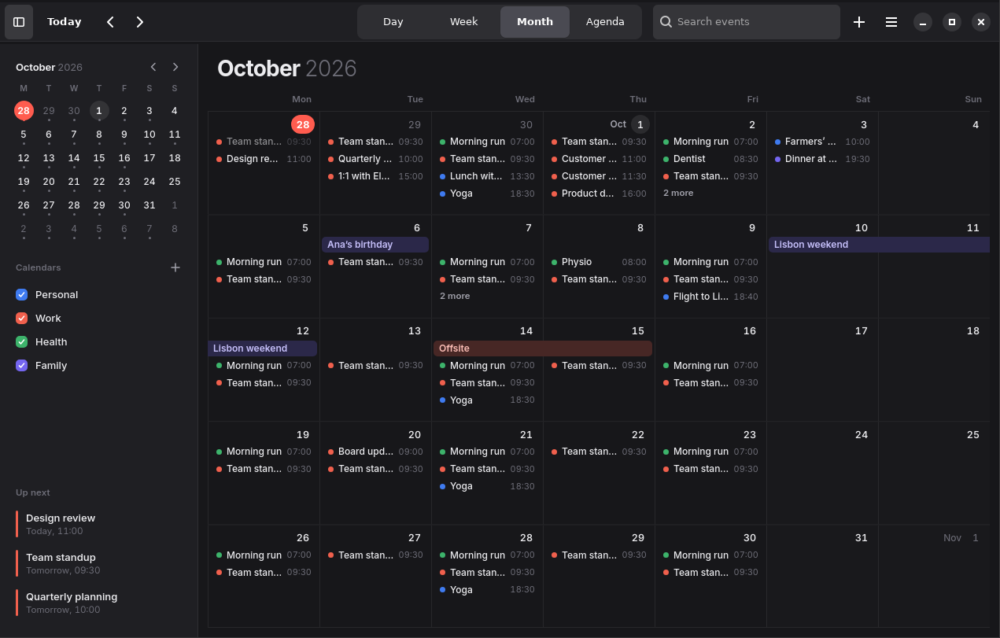
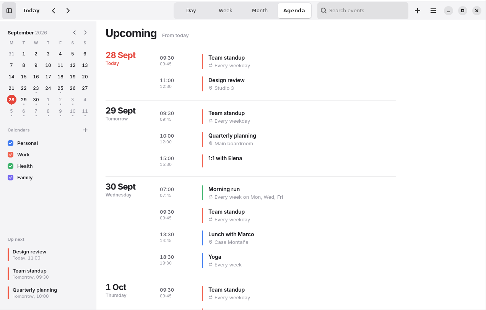
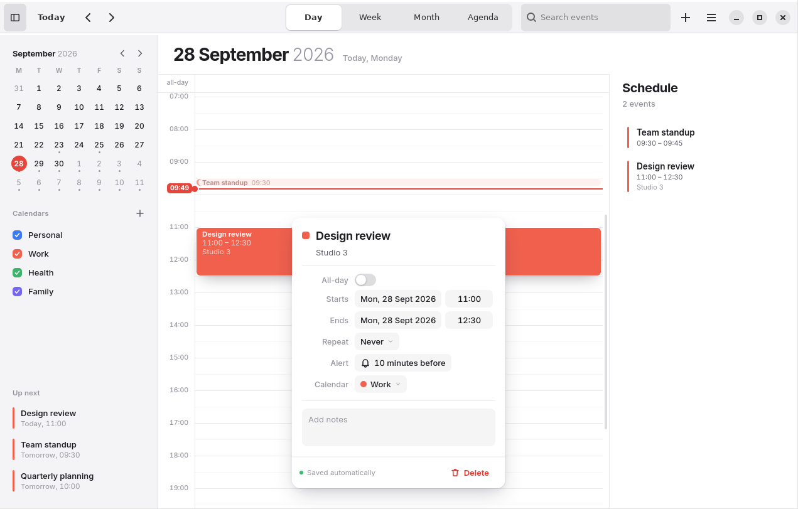

# Meridian

A calm, private calendar for Ubuntu.

Meridian is a native GNOME/Ubuntu desktop calendar with an Apple-inspired attention to detail: generous spacing, precise typography, quiet colour, and motion that only ever answers what you do. Your schedule stays on your computer. There are no accounts, no telemetry, and no network access at all.



| Month | Agenda | Dark |
|---|---|---|
|  |  |  |

## Features

- **Four views.** Day (with a schedule summary), week, month, and a scrolling agenda.
- **Direct manipulation.** Drag across the hours to create an event, drag an event to move it (across days and weeks too), and drag its bottom edge to resize. Everything snaps to 15 minutes, and the grid autoscrolls while you drag near an edge.
- **An editor that saves as you type.** Click any event for an anchored popover with no Save button. Times accept whatever you type: `9`, `930`, `9:30`, `9pm`, `21:15`.
- **Repeating events.** Choose from daily, weekdays, weekly, every 2 weeks, monthly, yearly, or a custom rule (interval, weekdays, and an end date or count). Moving or deleting one occurrence asks whether you mean *only this event* or *all future events*.
- **Reminders** arrive as native Ubuntu notifications, with a *Show* button that jumps to the event. Meridian can keep running in the background after you close the window, and can start quietly at login.
- **Colour-coded calendars.** Add, rename, recolour, hide, "show only this", or delete them.
- **Instant search** across titles, locations and notes, with results grouped into upcoming and past.
- **Undo and redo** for every change (Ctrl+Z / Ctrl+Shift+Z), plus a one-click *Undo* toast after deleting.
- **Import and export** standard `.ics` files, so your data is never locked in.
- **Light and dark** modes that follow Ubuntu's setting, or can be forced either way.
- **Responsive layout.** At narrow widths the sidebar collapses, the view switcher becomes a dropdown, and search moves behind an icon.
- **Accessible.** It's fully keyboard driven, has visible focus rings, ARIA roles and labels, and respects *reduce motion*.

## Install on Ubuntu

Meridian needs **Ubuntu 24.04 LTS or newer** (it uses GTK 4, libadwaita 1.5 and WebKitGTK 6, which all ship with 24.04).

```bash
sudo apt install ./meridian-calendar_1.0.2_all.deb
```

Use `apt` rather than `dpkg -i`: it pulls in any missing dependencies automatically. Meridian then appears in your app grid. You can also start it from a terminal:

```bash
meridian-calendar              # open normally
meridian-calendar --new-event  # open ready to add an event
meridian-calendar --background # start without a window (reminders only)
```

Right-click the dock icon for a **New Event** shortcut.

## Uninstall

```bash
sudo apt remove meridian-calendar
```

Removing the package never deletes your calendar. To erase your data as well:

```bash
rm -rf ~/.local/share/meridian ~/.config/meridian
rm -f ~/.config/autostart/io.github.meridiancal.Meridian.desktop
```

## Build the .deb yourself

```bash
# one-time: build and runtime dependencies
sudo apt install python3-gi gir1.2-gtk-4.0 gir1.2-adw-1 gir1.2-webkit-6.0 \
                 librsvg2-common dpkg-dev desktop-file-utils nodejs

make deb        # or: ./packaging/build-deb.sh
# -> dist/meridian-calendar_1.0.2_all.deb
```

The build script compiles the Python sources, runs the logic tests, validates the desktop file, stages the Debian filesystem layout, writes the `control`, `copyright` and `changelog` files, and builds the package with `dpkg-deb`. If `lintian` is installed, it runs that too. The package is architecture-independent (`all`), so the same `.deb` works on x86-64 and ARM.

## Run from source

```bash
make run        # or: ./bin/meridian-calendar
make debug      # enables the web inspector (right-click → Inspect) and console logging
make test       # headless logic tests (needs Node.js)
```

To try it without touching your real calendar, point it at a scratch folder filled with sample data:

```bash
MERIDIAN_DATA_DIR=/tmp/meridian-demo python3 tools/seed_demo.py
MERIDIAN_DATA_DIR=/tmp/meridian-demo ./bin/meridian-calendar
```

## Why this technology stack

The window is **native GTK 4 + libadwaita**, written in Python. The calendar surface inside it is drawn by **WebKitGTK**, the system web engine that GNOME itself uses (it powers GNOME Web).

I weighed three alternatives:

- **Electron** bundles an entire copy of Chromium: roughly a 150 MB download and 300 MB+ of memory for a calendar. That rules it out for an app meant to be fast and light.
- **Tauri** uses the same architecture as Meridian (system WebKit plus a native shell), but needs a Rust toolchain and a compile step for every change. Meridian's runtime is already on every Ubuntu desktop, so the entire package is under 200 KB and there's nothing to compile.
- **Drawing everything in pure GTK** would be the most "native", but fluid drag-and-drop, multi-day bars that span weeks, overlap layout and polished transitions are far harder to get right that way.

So each half does what it's best at:

| Native GTK / libadwaita | WebKitGTK surface |
|---|---|
| Header bar and real window controls | Month, week, day and agenda views |
| Segmented view switcher, search field, main menu | Drag, drop and resize |
| Preferences, About and Keyboard Shortcuts dialogs | The event editor, pickers and toasts |
| File chooser (via the desktop portal) | Recurrence, search, `.ics` parsing |
| System notifications, background mode, autostart | Undo history and autosave scheduling |
| Light/dark via `Adw.StyleManager` | |

The two halves talk over a small JSON bridge: WebKit's script-message handlers with replies.

## Privacy and security

Privacy is enforced technically, not just promised:

- **No network, ever.** The page's Content Security Policy sets `connect-src 'none'` and permits resources only from the app's own files. The web view uses an **ephemeral** network session, so there's no cache, no cookies, and no web storage on disk.
- **Locked navigation.** The web view can only show Meridian's own pages. Any other link opens in your normal browser, and nothing loads inside the app.
- **Nothing to phone home.** WebGL, WebAudio and media are disabled, and permission requests (camera, location and so on) are refused automatically.
- **The font is bundled** (Inter, SIL OFL), so there are no Google Fonts requests.
- **Private files.** Your data is written with `0600` permissions in a `0700` folder.
- **Crash-safe saving.** Each write goes to a temporary file, is `fsync`ed, then atomically renamed into place, so a power cut can never leave a half-written calendar. Meridian also keeps a rolling set of seven daily backups, and if the main file is ever damaged it recovers from the newest backup automatically.

### Where your data lives

| What | Where |
|---|---|
| Calendars and events | `~/.local/share/meridian/calendar.json` |
| Daily backups | `~/.local/share/meridian/backups/` |
| Settings | `~/.config/meridian/settings.json` |

Both files are plain JSON, so you can read them, back them up or version them however you like.

## Keyboard shortcuts

Press **Ctrl+?** in the app to see these in a native shortcuts window.

| Action | Keys |
|---|---|
| Today | `T` |
| Previous / next period | `←` `→` or `J` `K` |
| Day / week / month / agenda | `D` `W` `M` `A` or `1`–`4` |
| New event | `N` or `Ctrl+N` |
| Delete selected event | `Delete` |
| Close editor / clear selection | `Esc` |
| Undo / redo | `Ctrl+Z` / `Ctrl+Shift+Z` |
| Search | `Ctrl+F` or `/`, then `↓` to move into results |
| Sidebar | `Ctrl+B` |
| Preferences | `Ctrl+,` |
| Quit | `Ctrl+Q` |

## Project structure

```
meridian/
├── bin/meridian-calendar          Launcher (works from source and when installed)
├── meridian/                      Native shell (Python, GTK 4, libadwaita)
│   ├── application.py             App lifecycle, actions, notifications, background
│   │                              mode, autostart, Preferences/About/Shortcuts
│   ├── window.py                  Header bar, secured WebKit view, JSON bridge,
│   │                              file dialogs, save-on-quit
│   └── storage.py                 Atomic JSON storage with rolling backups
├── web/                           Calendar surface (no build step, no dependencies)
│   ├── index.html                 Shell with a strict no-network CSP
│   ├── css/app.css                Design tokens, components, light/dark, responsive
│   ├── fonts/inter.woff2          Bundled typeface
│   └── js/
│       ├── core.js                Dates, locale-aware formatting, DOM helpers, bridge
│       ├── recurrence.js          Expanding repeat rules; plain-language descriptions
│       ├── store.js               Data model, undo/redo, autosave, repeat-edit logic
│       ├── ics.js                 iCalendar import/export (RFC 5545 subset)
│       ├── views.js               Month, week, day, agenda, sidebar renderers
│       ├── interact.js            Drag to create/move/resize, drop between days
│       ├── editor.js              Event popover, menus, date/time pickers, dialogs
│       └── app.js                 State, navigation, keyboard, search, reminders
├── data/                          .desktop file, AppStream metainfo, icons
├── packaging/build-deb.sh         Builds the .deb
├── tests/logic.test.js            Headless tests for recurrence, store and .ics
├── tools/seed_demo.py             Sample data for trying the app out
├── Makefile
└── LICENSE                        GPL-3.0-or-later
```

## Design notes

- **Palette.** Cool neutral surfaces (`#F4F4F6` chrome on a white canvas; `#1F1F23` on `#17171A` in dark mode) and a single warm red accent, `#E5453B`. The accent is reserved for *today* and *now*, so it always means "this moment".
- **Type.** Inter, bundled, with tabular numerals wherever times line up. Month titles pair a heavy month name with a light year.
- **Events.** Tinted fills in the calendar's colour, with text mixed toward the ink colour so it stays readable in both themes. A thin colour edge anchors each block.
- **The "now" line.** A red rule across today, with a time pill in the gutter. The hour label it would collide with steps aside.
- **Motion.** Navigation slides in the direction you moved, the editor grows out of the event you clicked, and toasts rise. Nothing moves on its own, and everything respects *reduce motion*.

## Testing

`make test` runs 17 headless tests against the real source files, covering:

- recurrence edge cases: the 31st of the month, 29 February, `count`/`until`, and exceptions
- "only this event" and "all future events" moves and deletes
- undo/redo
- `.ics` round-tripping, including escaping, line folding, repeat rules, exceptions and alerts
- UTC and `DURATION` imports
- the time-entry parser

During development, the full app was also exercised in a virtual display. That included end-to-end checks that events reach disk through the atomic save path, and that reminders fire native notifications on time.

## Known limitations

- **No sync (yet).** Meridian is deliberately offline-first. To move data between machines today, export and import `.ics` files. CalDAV sync (Nextcloud, Fastmail, iCloud and so on) is the natural next step, and it fits the existing architecture: a sync worker on the Python side feeding the same store.
- **Reminders need Meridian running.** Keep *Keep running in the background* on (it's the default) and optionally turn on *Start at login*.
- **Floating local times.** Times mean "10:00 wherever I am", which suits personal calendars. When importing, UTC times are converted to local time, but `TZID` zones are read as local wall-clock times.
- **`.ics` import covers the common subset:** events, `RRULE` (`FREQ`, `INTERVAL`, `BYDAY`, `UNTIL`, `COUNT`), `EXDATE`, and alarms. Advanced rules such as "the second Tuesday of the month" are imported as their base frequency.

## Before publishing

The AppStream file has no homepage yet. If you publish this project, add `<url type="homepage">…</url>` to `data/io.github.meridiancal.Meridian.metainfo.xml` and update the maintainer address in `packaging/build-deb.sh`. The app ID `io.github.meridiancal.Meridian` assumes a GitHub organisation called `meridiancal`; change it throughout if yours differs.

## License

Meridian is free software under the **GNU GPL v3 or later**. The Inter typeface is © The Inter Project Authors, licensed under the SIL Open Font License 1.1.
